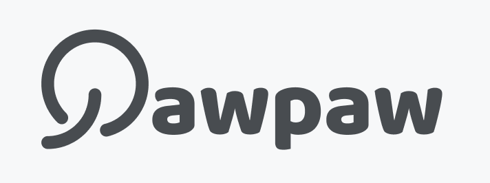
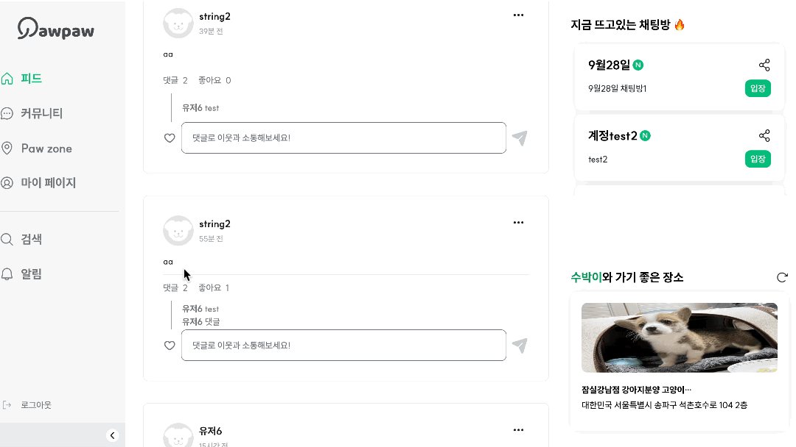
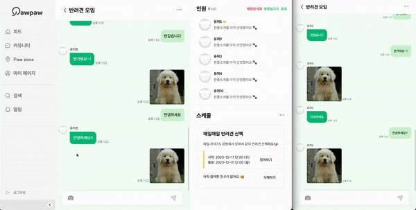
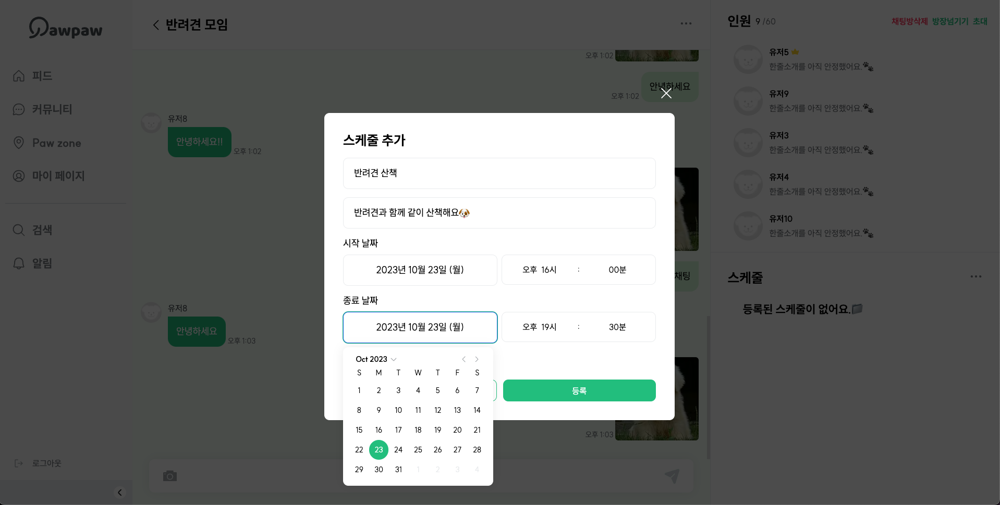
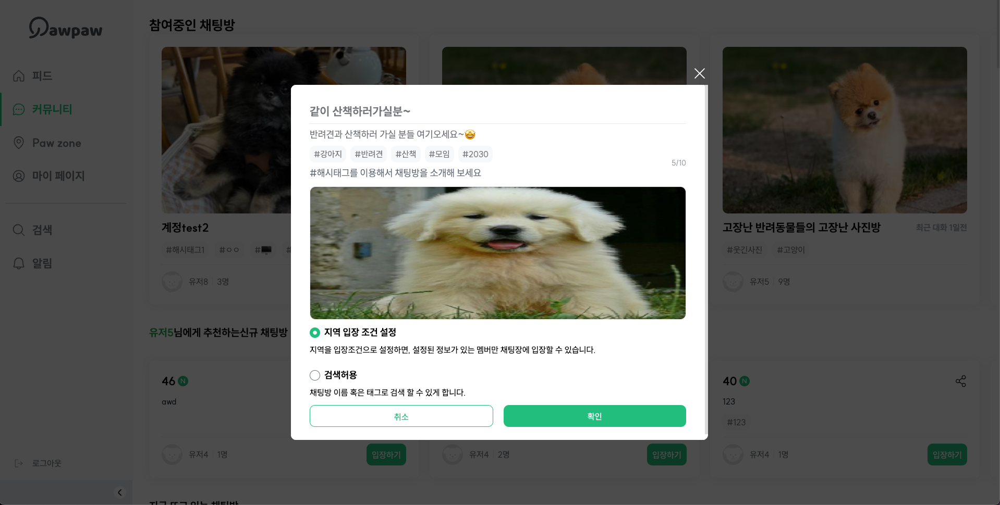
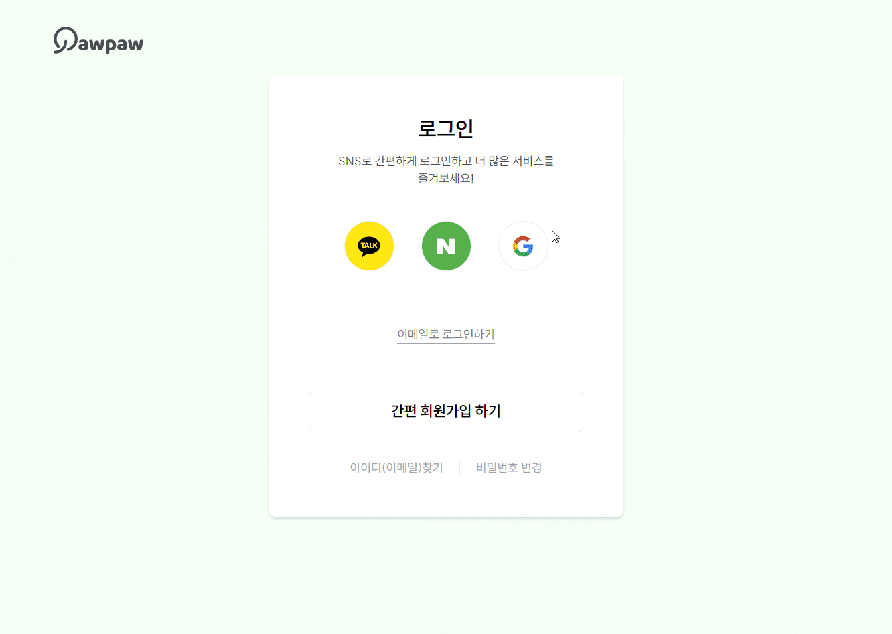
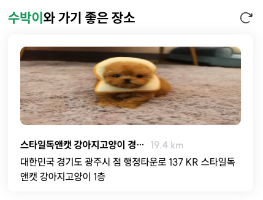
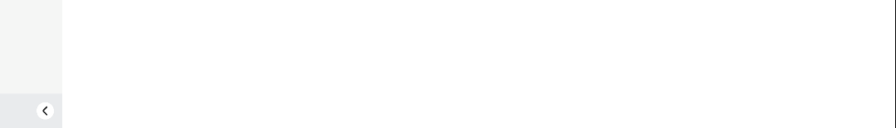

 

# 반려동물 커뮤니티 PAW-PAW

## 반려동물을 기르는 사람들끼리 소통 할수있는 플랫폼입니다.

[서비스 구경하기🐾](https://www.paw-paw.xyz/)

## 참여 인원

> |                     Name                      |            Position             |
> | :-------------------------------------------: | :-----------------------------: |
> |      [신현석](https://github.com/shseok)      | 로그인, 회원가입, PAWZONE(진행) |
> | [이지예](https://https://github.com/jiyeeeah) |       게시글, 마이페이지        |
> |     [정태진](https://github.com/taejinii)     |  커뮤니티 페이지 , 실시간 채팅  |
>
>  

## 🛠️ 기술 스택

 

## 💻 주요 기능 및 페이지 소개

<table>
  <tbody>
    <tr>
      <th>메인페이지</th>
      <th>게시글페이지</th>
    </tr>
    <tr>
      <td></td>
      <td></td>
    </tr>   
    <tr>
      <td>• 무한스크롤 및 반응형 구현 • 댓글 및 좋아요 기능 • 더보기 버튼을 통해 북마크, 삭제, 공유 구현</td>
      <td>• Intercepting Routes와 Parallel Routes • 게시글 클릭시 게시글 id값을 가진 모달로 이동 • 모달에서 새로고침시(또는 그 url로 바로 접근했을 경우) 단일 게시글 페이지로 보여짐 </td>
    </tr> 
    <tr>
      <th>커뮤니티 페이지</th>
      <th>실시간 채팅 페이지</th>
    </tr>
    <tr>
    <td></td>
      <td></td>
    </tr>
    <tr>
      <td>• 참여중인,추천 채팅방 캐러셀 및 반응형 구현 • 뜨는채팅방 무한스크롤 구현</td>
      <td>• 실시간 채팅,이미지 업로드 기능 • 이전 채팅 조회 역방향 무한스크롤 • 채팅입력시 스크롤 자동하단 위치,이전 채팅 조회 시 스크롤유지 • 유저초대, 방장위임, 방삭제, 스케줄 추가, 스케줄삭제 (방장만 가능)</td>
    </tr>
    <tr>
      <th>스케줄 생성 모달</th>
      <th>채팅룸 생성모달</th>
    </tr>
    <tr>
      <td></td>
      <td></td>
    </tr>
    <tr>
      <td>• 스케줄 시작날짜 종료날짜 일,월 단위로 선택가능 • 방장만 생성 가능하며 모든 필드를 입력해야 생성 가능</td>
      <td>• 채팅룸 생성 모달 반응형 적용 • 채팅룸 커버 이미지 업로드 기능 • 해시태그 입력 및 백스페이스,클릭시 삭제가능 • 채팅룸 이름,설명,커버이미지 를 입력해야 확인 버튼 활성화 • 서버 과부하를 막기 위해 네트워크 요청전 필드값 유효성 검사</td>
    </tr>
    <tr>
      <th>간편 로그인 / 회원가입 페이지</th>
      <th>소셜 로그인 / 회원가입 페이지</th>
    </tr>
    <tr>
      <td></td>
      <td></td>
    </tr>
    <tr>
      <td>• 이메일 / 비밀번호 로그인 • 이메일 찾기 / 비밀번호 변경 • 이메일 찾기 / 비밀번호 변경 </td>
      <td>• google / kakao / naver 로그인 • 회원가입시 약관 동의 > 위치 설정 > 프로필 설정 절차 진행 • provider에서 제공하는 이름과 이미지 리소스 사용</td>
    </tr>
    <tr>
      <th>마이페이지</th>
      <th>유저 위치기반 장소추천 컴포넌트</th>
    </tr>
    <tr>
      <td></td>
      <td></td>
    </tr>
    <tr>
      <td>• 내 프로필 • 내 게시글, 참여중인 채팅방, 북마크한 게시글</td>
      <td>• Google Map API 를 활용 유저 정보기반 장소추천 컴포넌트 • 현재 유저가 위치한곳으로부터 떨어진 거리 표시</td>
    </tr>
    <tr>
      <th>사이드바 리팩토링</th>
      <th>Toast 알림</th>
    </tr>
    <tr>
      <td></td>
      <td> </td>
      <tr>
      <tr>
        <td>• 하이드레이션 버그 픽스 • 리렌더링 최적화</td>
        <td>• error, success발생시 사용가능한 toast알림 구현 • react-toastify 라이브러리 활용</td>
      </tr>
    </tbody>

</table>
